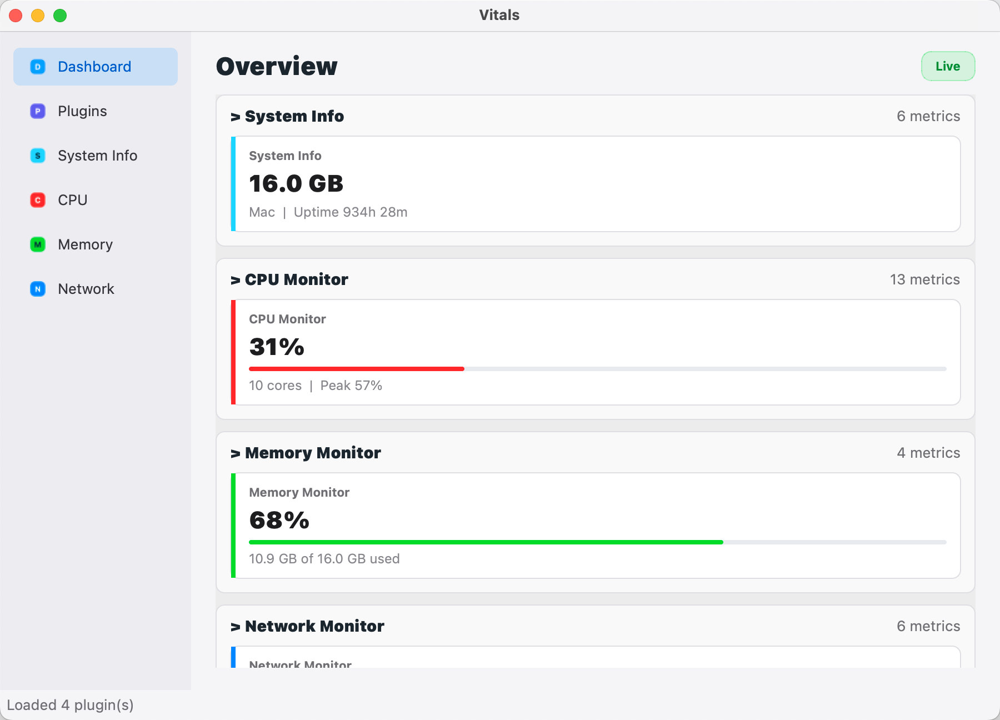
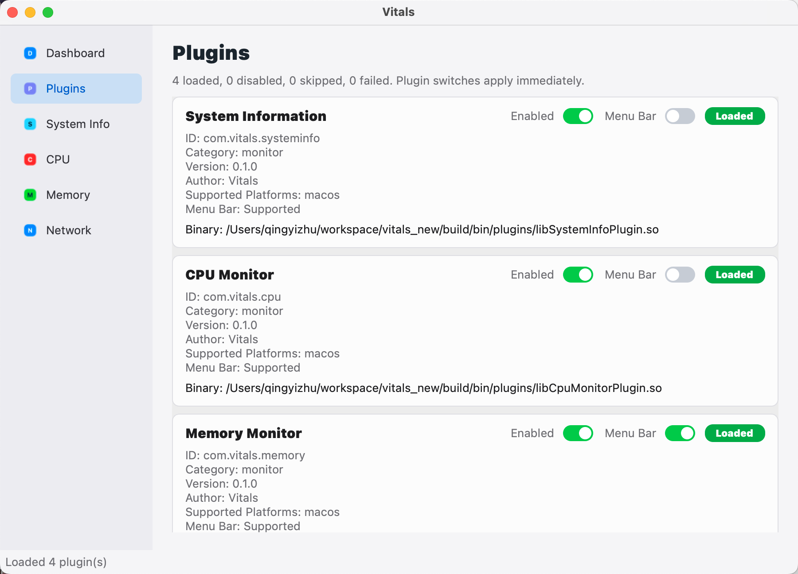
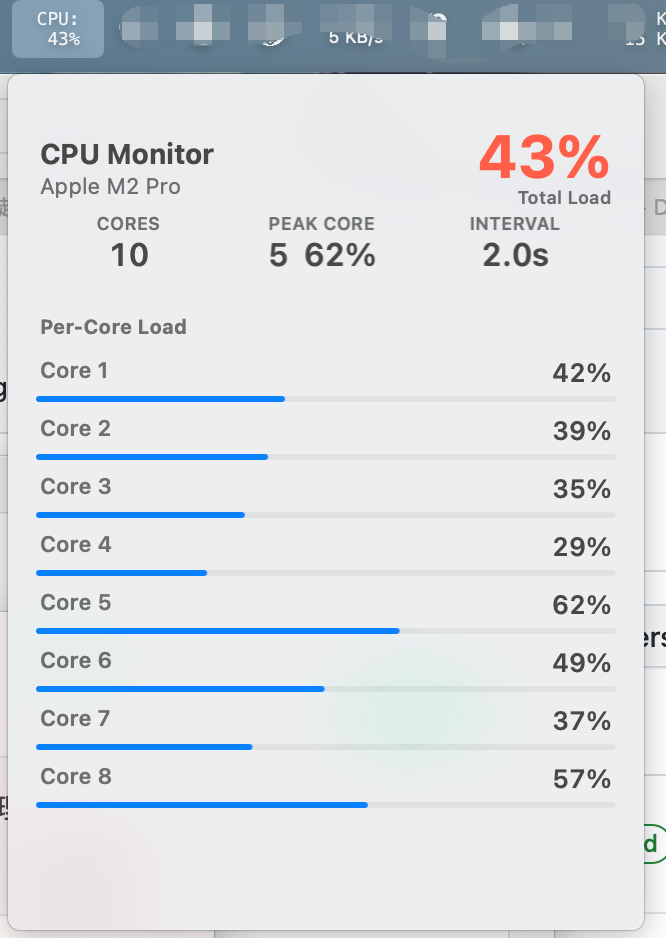
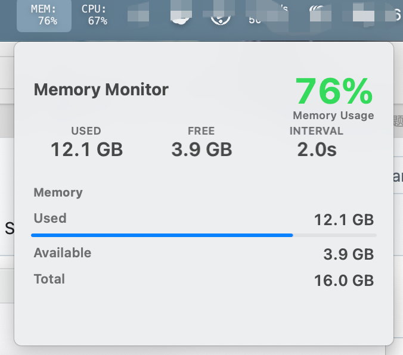
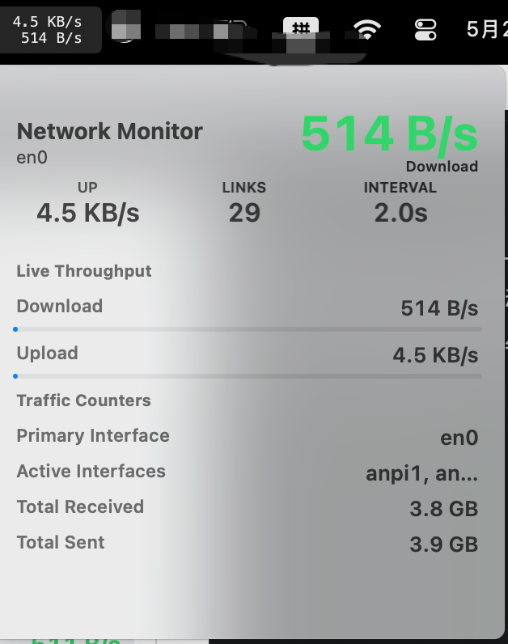

# Vitals

English | [中文](#中文)

Vitals is a C++ / Qt / CMake desktop system monitor framework built around a host application, plugin SDK, metric center, and extensible UI panels.

The host application owns the main window, navigation, plugin lifecycle, metric routing, and display containers. Concrete monitoring capabilities are implemented as plugins, so the core application can stay small while new system metrics and UI surfaces are added independently.

## Screenshots

The current macOS build already demonstrates the main host shell, plugin-managed pages, and menu-bar metric details.

<p align="center">
  
</p>

<p align="center"><strong>Dashboard overview</strong><br>
The dashboard collects live plugin metrics into one host-owned view while keeping concrete monitoring logic inside plugins.</p>

<p align="center">
  
</p>

<p align="center"><strong>Plugin center</strong><br>
Built-in plugins expose runtime status, platform metadata, and menu-bar visibility controls through the host plugin manager.</p>

### Menu-Bar Details

Each plugin can contribute a compact menu-bar summary and a richer detail view through taskbar capabilities.

| CPU Monitor | Memory Monitor | Network Monitor |
| --- | --- | --- |
|  |  |  |
| Total and per-core CPU usage with refresh interval context. | Used, available, and total physical memory at a glance. | Active interface, live transfer rates, and accumulated traffic. |

## Features

- Host application with dashboard, navigation, and plugin center.
- Plugin SDK for monitor, panel, taskbar, and settings capabilities.
- Metric center for collecting and distributing plugin-provided metric data.
- Platform-aware plugin loading through `supportedPlatforms` metadata.
- Cross-platform taskbar, tray, or menu-bar indicator backed by live metrics.
- Built-in system information, CPU, memory, network, and macOS disk plugins using the plugin runtime.

## Requirements

- CMake 3.20 or newer.
- A C++17 compiler.
- Ninja, or another CMake-supported generator.
- Qt 6 Core and Widgets, or Qt 5.15 Core and Widgets.

## Build

```bash
cmake -S . -B build -G Ninja
cmake --build build
```

The application is emitted to:

```text
build/bin/Vitals
```

Plugins are emitted to:

```text
build/bin/plugins/
```

## Project Structure

```text
app/       Qt host application, windows, navigation, and app context
core/      Plugin manager, metric center, and shared runtime logic
sdk/       Public plugin interfaces and metric data contracts
widgets/   Reusable Qt widgets for displaying metrics
plugins/   Built-in monitoring plugins
docs/      Development notes and plugin authoring guide
```

## Plugin Development

Vitals is designed to grow through plugins. A plugin can expose one or more capabilities, such as:

- monitor capability for producing metrics;
- panel capability for rendering dashboard UI;
- taskbar capability for concise status display;
- settings capability for plugin configuration.

Start with [docs/PLUGIN_DEVELOPMENT.md](docs/PLUGIN_DEVELOPMENT.md) if you want to build a custom plugin.

## Plugin Status

The current codebase includes the following built-in plugins. All of them are declared as monitor-category plugins, and each plugin advertises its implemented platforms through `supportedPlatforms` metadata. The host applies a stable default navigation order based on monitor priority: system information first, then CPU, memory, GPU, network, disk, battery, process, and any remaining plugins by name.

| Plugin | ID | Capabilities | Metrics / data | Implemented platforms |
| --- | --- | --- | --- | --- |
| System Information | `com.vitals.systeminfo` | Monitor, panel, taskbar, settings | Device name, OS version, CPU model, GPU model, total memory, uptime | macOS, Windows |
| CPU Monitor | `com.vitals.cpu` | Monitor, panel, taskbar, settings | CPU model, logical cores, total CPU usage, per-core usage | macOS, Windows |
| Memory Monitor | `com.vitals.memory` | Monitor, panel, taskbar | Total memory, used memory, available memory, memory usage percentage | Windows, macOS, Linux |
| Network Monitor | `com.vitals.network` | Monitor, panel, taskbar, settings | Primary interface, active interfaces, download/upload rate, total received/sent bytes | Windows, macOS |
| Disk Monitor | `com.vitals.disk` | Monitor, panel, taskbar, settings | Selected mounted volume, mount path, file system, total/used/available capacity, usage percentage | macOS |

Other platforms are not implemented yet. The plugin manager will skip plugins whose `supportedPlatforms` metadata does not match the current host platform.

## Current Status

The initial framework includes:

- SDK interfaces for the base plugin contract, monitor/panel/taskbar/settings capabilities, app context, and metrics.
- Core plugin manager and metric center.
- Platform-aware plugin loading through `supportedPlatforms` metadata.
- Qt host application with dashboard and navigation.
- Cross-platform taskbar/tray/menu-bar indicator fed by `MetricCenter`, with capability-aware plugin integration.
- Windows taskbar text overlays for plugin summaries. Each enabled taskbar-capable plugin owns its own visible button and opens only its own detail popup.
- Per-plugin taskbar visibility controls in the plugin center; disabling and re-enabling a plugin taskbar display rebuilds the Windows overlay set cleanly.
- System information, CPU, memory, network, and macOS disk plugins loaded through the plugin runtime using the new "plugin shell + capability objects" structure; the network plugin currently provides Windows and macOS collectors.
- Stable plugin display ordering in the host runtime, so system information appears before CPU, memory, and other monitor plugins regardless of filesystem scan order.

See `docs/TASK_PLAN.md` for the current task plan.

## Roadmap

Planned follow-up work includes:

- Stabilize the host runtime: verify plugin loading, dashboard rendering, and menu-bar/tray behavior across supported desktop environments.
- Improve plugin management: show loaded, disabled, skipped, and failed plugins with clearer runtime status and error details.
- Add a unified settings surface for `settingsCapability`, so plugin configuration can be hosted consistently.
- Expand platform support by adding Linux collectors for CPU, system information, and network plugins.
- Strengthen the metric pipeline with refresh throttling, history buffers, and chart-ready time-series data.
- Continue the shared UI component system with reusable chart, gauge, table, tile, and row widgets.
- Add more built-in monitor plugins, including battery, GPU, and process monitors; expand the disk plugin beyond macOS after platform-specific validation.
- Add smoke tests and automated checks for plugin discovery, metadata parsing, platform filtering, and metric publication.
- Improve packaging and release flow for macOS first, then Windows and Linux.

## License

Vitals is released under the [MIT License](LICENSE).

---

# Vitals

[English](#vitals) | 中文

Vitals 是一个基于 C++ / Qt / CMake 的桌面系统监控框架。项目围绕宿主应用、插件 SDK、指标中心和可扩展 UI 面板构建。

宿主应用负责主窗口、导航、插件生命周期、指标路由和展示容器。具体的监控能力由插件实现，因此核心应用可以保持轻量，同时允许后续独立扩展新的系统指标和界面能力。

## 截图

当前 macOS 构建已经跑通宿主外壳、插件页面以及菜单栏指标详情。

<p align="center">
  
</p>

<p align="center"><strong>Dashboard 总览</strong><br>
Dashboard 将插件上报的实时指标汇总到宿主统一视图中，具体采集逻辑仍然保留在插件内部。</p>

<p align="center">
  
</p>

<p align="center"><strong>插件中心</strong><br>
内置插件通过宿主插件管理器展示运行状态、平台元数据和菜单栏显示开关。</p>

### 菜单栏详情

每个插件都可以通过任务栏能力贡献紧凑的菜单栏摘要，以及信息更完整的详情视图。

| CPU Monitor | Memory Monitor | Network Monitor |
| --- | --- | --- |
|  |  |  |
| 展示 CPU 总使用率、单核心使用率和刷新间隔信息。 | 快速查看已用、可用和总物理内存。 | 展示活跃网卡、实时上传/下载速率和累计流量。 |

## 功能特性

- 提供带仪表盘、导航和插件中心的 Qt 宿主应用。
- 提供面向监控、面板、任务栏和设置能力的插件 SDK。
- 通过指标中心收集并分发插件提供的指标数据。
- 通过 `supportedPlatforms` 元数据支持按平台加载插件。
- 支持由实时指标驱动的跨平台任务栏、托盘或菜单栏状态显示。
- 内置系统信息、CPU、内存、网络和 macOS 磁盘插件，并通过插件运行时加载。

## 环境要求

- CMake 3.20 或更高版本。
- 支持 C++17 的编译器。
- Ninja，或其他 CMake 支持的构建生成器。
- Qt 6 Core 和 Widgets，或 Qt 5.15 Core 和 Widgets。

## 构建

```bash
cmake -S . -B build -G Ninja
cmake --build build
```

应用程序输出到：

```text
build/bin/Vitals
```

插件输出到：

```text
build/bin/plugins/
```

## 项目结构

```text
app/       Qt 宿主应用、窗口、导航和应用上下文
core/      插件管理器、指标中心和共享运行时逻辑
sdk/       公共插件接口和指标数据契约
widgets/   用于展示指标的可复用 Qt 组件
plugins/   内置监控插件
docs/      开发说明和插件编写指南
```

## 插件开发

Vitals 通过插件扩展能力。一个插件可以暴露一种或多种能力，例如：

- monitor capability：生成监控指标；
- panel capability：渲染仪表盘界面；
- taskbar capability：提供简洁的状态展示；
- settings capability：提供插件配置入口。

如果你想开发自定义插件，可以从 [docs/PLUGIN_DEVELOPMENT.md](docs/PLUGIN_DEVELOPMENT.md) 开始。

## 插件状态

当前代码包含以下内置插件。它们都声明为 monitor 类插件，并通过 `supportedPlatforms` 元数据声明已经实现的平台能力。宿主会按监控优先级应用稳定的默认导航顺序：系统信息优先，其次是 CPU、内存、GPU、网络、磁盘、电池、进程，其他插件再按名称排序。

| 插件 | ID | 能力 | 指标 / 数据 | 已实现平台 |
| --- | --- | --- | --- | --- |
| System Information | `com.vitals.systeminfo` | 监控、面板、任务栏、设置 | 设备名、系统版本、CPU 型号、GPU 型号、总内存、运行时长 | macOS, Windows |
| CPU Monitor | `com.vitals.cpu` | 监控、面板、任务栏、设置 | CPU 型号、逻辑核心数、CPU 总使用率、单核心使用率 | macOS, Windows |
| Memory Monitor | `com.vitals.memory` | 监控、面板、任务栏 | 总内存、已用内存、可用内存、内存使用率 | Windows, macOS, Linux |
| Network Monitor | `com.vitals.network` | 监控、面板、任务栏、设置 | 主网络接口、活跃接口、下载/上传速率、累计接收/发送字节数 | Windows, macOS |
| Disk Monitor | `com.vitals.disk` | 监控、面板、任务栏、设置 | 当前挂载卷、挂载路径、文件系统、总/已用/可用容量、使用率 | macOS |

其他平台尚未实现。插件管理器会根据 `supportedPlatforms` 元数据判断平台兼容性，并跳过不匹配当前宿主平台的插件。

## 当前状态

初始框架已经包含：

- 基础插件契约、监控/面板/任务栏/设置能力、应用上下文和指标相关的 SDK 接口。
- 核心插件管理器和指标中心。
- 通过 `supportedPlatforms` 元数据实现的平台感知插件加载。
- 带仪表盘和导航的 Qt 宿主应用。
- 由 `MetricCenter` 驱动、可感知插件能力的跨平台任务栏/托盘/菜单栏指示器。
- Windows 任务栏支持每个已启用 taskbar capability 的插件拥有独立文本按钮，并且每个按钮只打开自己的插件详情。
- 系统信息、CPU、内存、网络和 macOS 磁盘插件，使用新的 “plugin shell + capability objects” 结构通过插件运行时加载；网络插件当前提供 Windows 和 macOS collector。
- 宿主运行时已经支持稳定的插件展示顺序，系统信息会优先显示，然后是 CPU、内存和其他监控插件，不再依赖文件系统扫描顺序。

当前任务计划见 [docs/TASK_PLAN.md](docs/TASK_PLAN.md)。

## 后续开发计划

后续计划包括：

- 稳定宿主运行时：验证插件加载、Dashboard 渲染，以及菜单栏 / 托盘在不同桌面环境下的表现。
- 完善插件管理：展示已加载、已禁用、已跳过和加载失败的插件，并提供更清晰的运行状态和错误信息。
- 为 `settingsCapability` 接入统一设置界面，让插件配置由宿主统一承载。
- 扩展平台支持：为 CPU、系统信息和网络插件补充 Linux collector。
- 强化指标链路：加入刷新节流、历史缓存，以及可直接用于图表展示的时间序列数据。
- 继续建设通用 UI 组件体系，补充图表、仪表盘、表格、信息块和行组件。
- 增加更多内置监控插件，包括电池、GPU 和进程监控；磁盘插件后续在完成平台验证后再扩展到 macOS 以外的平台。
- 增加 smoke test 和自动化检查，覆盖插件发现、元数据解析、平台过滤和指标发布。
- 完善打包和发布流程，优先支持 macOS，随后扩展到 Windows 和 Linux。

## 许可证

Vitals 使用 [MIT License](LICENSE) 开源。
